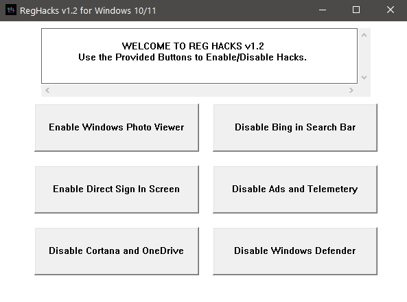

# RegHacks
Some Registry Hacks for Windows 10 (and 11?)

---

### Compile Commands:
1. `xxxx-w64-mingw32-windres RegHacks.rc Resources.o`
2. `xxxx-w64-mingw32-g++ -std=c++20 -Og -s -static -flto RegHacks.cpp Resources.o -o RegHacks.exe -mwindows -municode -lwinmm -Wno-conversion-null`

##### NOTE: Do not use compiler optimizations above `-Og`, because that optimizes out the gui loop.
